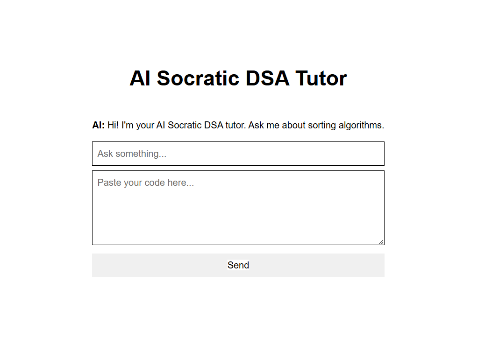

# AI Socratic DSA Assistant

This project is an AI-powered full-stack tutoring platform that helps students learn Data Structures and Algorithms through guided reasoning using the Socratic learning methodology.

# 📌 Problem Statement

Most students learning Data Structures and Algorithms tend to memorize solutions instead of building intuition.
This project solves that problem by creating an AI tutor that:

* Does NOT give direct answers
* Guides students using structured questioning
* Builds conceptual understanding of algorithms
* Encourages active problem solving

# ⚙️ Tech Stack

## Frontend

* Next.js
* TypeScript
* Tailwind CSS

## Backend

* FastAPI
* Python
* Groq LLM API
* REST API architecture

## Database

* PostgreSQL (Neon)

## Deployment

* Netlify (Frontend)
* Render (Backend)

# Project Structure
  ```text
ai-socratic-dsa-assistant/
│
├── backend/
│   ├── app/
│   │   ├── routes/
│   │   ├── services/
│   │   ├── database/
│   │   ├── analyzers/
│   │   └── models/
│   │   
│   └── requirements.txt
│
├── frontend/
│   ├── app/
│   ├── components/
│   ├── services/
│   └── public/
│
└── README.md
```

#  System Architecture

```
User Input → Next.js Frontend → FastAPI Backend → Socratic Prompt Engine → Groq LLM → Response → UI
```

# 🔄 System Flow

1. Student submits a DSA question.
2. Frontend sends the request to the FastAPI backend.
3. Backend retrieves recent conversation history.
4. Socratic Prompt Engine builds a contextual prompt.
5. Prompt is sent to the Groq LLM.
6. AI generates a guided response.
7. Response is stored in PostgreSQL.
8. Response is returned to the frontend.

#  AI Behavior (Socratic Engine)

The AI is strictly designed to:

* Ask only ONE question at a time
* Avoid giving direct solutions
* Guide step-by-step reasoning
* Focus on intuition building
* Use hints only when needed

# 👨‍💻 Contributions

This project was developed as a collaborative effort.

## 🔹 My Contributions

### Backend Development
* Designed and implemented FastAPI backend architecture
* Built chat API endpoint (`/chat`)
* Implemented conversation history management
* Integrated PostgreSQL database layer

### AI Engineering
* Designed and refined the Socratic prompting strategy
* Integrated Groq LLM API
* Built context-aware tutoring workflow
* Developed guided reasoning logic for DSA learning

### Code Analysis Support
* Implemented code analysis pipeline
* Built code-context generation for tutoring assistance
* Integrated code feedback workflow

### Full-Stack Integration
* Connected Next.js frontend with FastAPI backend
* Implemented API communication layer
* Managed end-to-end request and response flow

### Deployment & DevOps
* Deployed backend on Render
* Configured frontend deployment on Netlify
* Managed environment variables
* Debugged production deployment issues

### Documentation
* Created technical documentation and setup instructions

## 🔹 Teammate Contributions

* Contributed to frontend project setup and component structure
* Assisted with chat interface development using Next.js
* Supported database integration and data management tasks
* Contributed to UI styling and user experience improvements
* Participated in testing, debugging, and integration activities

# 🚀 How to Run

## 1. Clone Repository

```bash
git clone https://github.com/reethika-ai/ai-socratic-dsa-assistant
cd ai-socratic-dsa-assistant
```

---

## 2. Backend Setup

```bash
cd backend
python -m venv .venv
.venv\Scripts\activate   # Windows

pip install -r requirements.txt
```

### Run Backend

```bash
uvicorn app.main:app --reload
```

---

## 3. Frontend Setup

```bash
cd frontend
npm install
npm run dev
```

---

# Environment Variables

## Backend (.env)

```env
GROQ_API_KEY=your_api_key
DATABASE_URL=your_postgres_url
```

---

# 🌐 API Endpoints

## Chat Endpoint

### POST /chat

### Sample Request

```json
{
  "student_id": "student_001",
  "message": "Explain quick sort",
  "code": ""
}
```

### Sample Response

```json
{
  "response": "What happens when you choose a pivot and divide the array into two parts?"
}
```

# 💬 Sample Interaction

## User

Explain merge sort

## AI

What do you think happens when two already sorted lists are merged together?

## User

What is quick sort?

## AI

How does choosing a pivot help divide the problem into smaller parts?

# 🔗 Live Demo

 Frontend:
 https://ai-socratic-dsa-assistant.netlify.app/

 Backend API:
 https://ai-socratic-dsa-assistant-8.onrender.com/docs

## Deployment Stack
  Netlify
  Render
  Neon

# 📸 API Preview



# 📈 Future Improvements

* Adaptive difficulty based on student level
* Progress tracking system
* Personalized learning paths
* Multi-language support

# 🏁 Summary

This project demonstrates an end-to-end AI tutoring platform that combines modern web development, prompt engineering, Large Language Models, and cloud deployment to create an interactive DSA learning experience.
